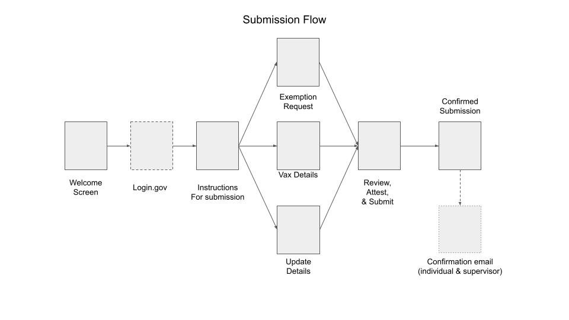
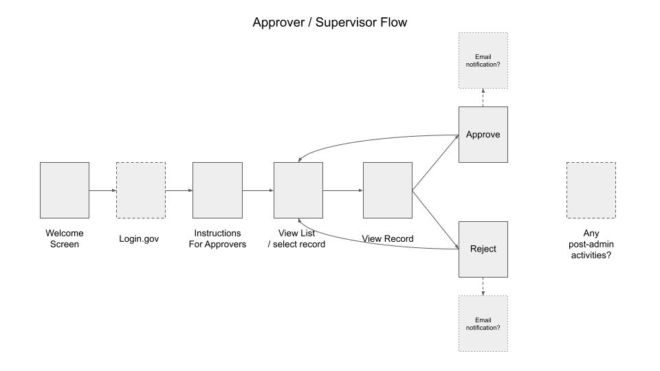

# Users, Product, and more

This is a collection of notes regarding our findings regarding potential needs for an initial system that would capture and retain PHI (personal health information). While our initial prototypes involved *attestation*, our pivot involved collecting *evidence* of vaccination status. This was a more challenging design target, but we were able to leverage our previous efforts regarding attestation. As a result, the attestation design is subsumed in the design sketch that follows.

## Users

As part of our work we spoke to representatives from multiple agencies to better understand the challenges they faced. The conversations helped us understand the broad range of use cases and unique scenarios within different agencies. The conversations began focused on the contractor population but often shifted to the employee use cases as the interactions are so intertwined. A few themes emerged that are worth further exploration.

### Diversity of workforce

The contracting workforce is a diverse group with incredibly different scenarios for how they work and support their agencies. The broad range of working environments, hours, methods of entry, and responsibilities makes it difficult to create policies that cover all outcomes. Practically, this means that there are some ‘standard’ cases, but there are many unique variations or exceptions. Some agencies had more than others (for example, any agency with healthcare facilities or responsibilities) and those scenarios need to be played out to see how the tools and processes need to change to suit them.

### Who are the “front line workers?”

For each agency, there are people that interact with visitors and building occupants more than others. Beyond the obvious security personnel in ‘front of house’ roles, some agencies have counselors, advisors, and client-facing staff as part of their operations. We recommend future teams take the time to understand these specific roles and scenarios as they look for prioritizing efforts, tools, and communication.

### The realities of a growing remote workforce

Agencies we talked to will be changed forever by the pandemic as they move more roles to remote work. This changes the way teams interact with facilities, contracting partners, and policies. Any solution for attestation has to account for a future where buildings have lower occupancies and there are fewer physical interactions between individuals. Solutions for attestation and vaccine-related interactions will need to prepare scenarios for a group who only visit the office once or twice a quarter, if at all. The new remote workforce also increases the need for communication through email and other asynchronous channels.

## Organizations

### Workplace changes

A number of agencies we spoke to plan to move more employees to full-time teleworking. While this lessens the need for some workplace policies, it adds layers of complexity to communication plans as well as tooling decisions. As fewer face-to-face interactions become the norm, the use cases will have to shift to follow. In this case, it means fewer physical reviews of cards and more digital assets to manage and protect.

### Buildings as community

Programs designed for Federal buildings should account for employees, contractors, visitors, and the community the building resides in. While some buildings are set back and distinct from their surroundings, many are part of neighborhoods and busy streets. Rules and regulations for safety should take these people and business into account.

### Handling Visitors

If visitors are lined up outside a building waiting for appointment times, the businesses on the same street will want to know they and their customers are safe. Providing information to the adjacent businesses could help alleviate concerns and proactively establish the policies before problems arise.

## Product

### Perception of safety

In one way or another all the agencies spoke about managing the perception of safety in their buildings and to their staff. An effective policy is one that makes it easier for all to recognize that complying with policy *actually* makes the workplace safer. They also want to know the policies are consistent from building to building and person to person.

### People see the holes

If there are holes in an enforcement program, people will see them. They may not act on or abuse them, but they will see them and their trust will suffer for it. When looking at enforcement programs, this means if you collect information you have to explain how it’s being used to help them. Taking a bit of data but not making decisions with it (or ignoring) encourages apathy towards the overall program.

### Communication of goals
Whatever the goal is, make it clear to all parties so employees and supervisors can support it. Executives and supervisors want to help push for outcomes, but need the goals identified and supported by documentation and communication. Changing individual behaviors are easier when reinforced by outcomes all can agree on.

#### Create for the whole communication chain

Materials need to be created not only for the employees, but also for the supervisors and administrators. In some cases the materials will have the same core material but need context for how to discuss the issues and deal with such a challenging topic.

#### Give supervisors tools

Supervisors will be pushed to have numerous conversations about vaccination. One-on-ones with direct reports will be powerful conversations, but only if supervisors have a clear communication plan. Shared resources across agencies will also ensure employees are hearing the same messages from supervisors.

#### Clarify Federal vs. Agency

Over-communicating the policy requirements as mandated by Federal rules can help add to the clarity of communication. Every agency will have unique and specific scenarios for communicating, but reinforcing the overarching nature of the policies can help prevent “answer shopping” or individuals using one agency’s decisions for their circumstances.

### Notification loops

A notification loop is anywhere in a system where action is taken and a confirmation of some sort follows. Notification loops are critical to a successful system design when they are clear and timely. We worry that a system that allows action with no notifications could (for example) mean paperwork sits in queue when it needs immediate attention. Similarly, if a system records data and asks for confirmation of correctness, what happens if the confirmation is lost, or gets caught in a spam filter? Having clear loops and mechanisms for users and supervisors to confirm that processes are operating correctly will be critical to a successful systems implementation.

## User Flows

Early work on the flows for the system are below, along with screen inventories for each. Again, notification loops appear critical to a successful system because of the timely nature of the transactions. Notification loops bring in a host of challenges and issues, but without them there are concerns supervisors can become roadblocks and/or submitted materials may sit while critical time passes.

We also want to respect the time of supervisors (who we anticipate being overwhelmed with tasks), as we want them to know when materials are ready to review. Having a supervisor pull up the system only to find no materials to review would be unproductive and frustrating.

### Individual Submission

The basic flow for an individual to submit their details for review (be it vaccination details or the request for an accommodation).

#### Page Inventory

##### Welcome Page (Individual)
**Goal**: Provide details of application and links to login methods

**Elements**: Explainer copy, links to logins, links to policies, links to support mechanisms

##### Post-login Instructions (Individual)
**Goal**: Receive user after using login service, present options for form submission or exemption request.
**Elements**: Links to submission form, link to exemption request

##### Vax Details Entry (Individual)
**Goal**: Allow users to input vaccine information
**Elements**: Explainer copy, form elements, submission
##### Exemption Request  (Individual)
**Goal**: Allow user to provide information for vaccine exemption
**Elements**: Explainer copy, form elements, submission

##### Update Details  (Individual)
**Goal**: Allow an individual to update their information (common scenario, 2nd dose?)
**Elements**: Explainer copy, form elements, submission

##### Review, Attest & Submit  (Individual)
**Goal**: Show information as input, show attestation details, allow for individuals to go back and edit or to submit with attestation.
**Elements**: Copy, checkbox for attestation, links back, submit button

##### Confirm Submission
**Goal**: Confirm action, copy and links to other actions, fire off email (if needed)
**Elements**:

#### Approver or Supervisor flow

##### Welcome Page (All cases)
**Goal**: Provide details of application and links to login methods
**Elements**: Explainer copy, links to logins, links to policies, links to support mechanisms

##### Post-login Instructions (Supervisor)
**Goal**: Receive user after using login service, give details on requirements for supervisors
**Elements**: Links to view list

##### View List and select record (Supervisor)
**Goal**: Show all pending records for review, also show reports who have not submitted?
**Elements**: List(s) of direct reports - awaiting approval, approved, not yet submitted

##### View Record (Supervisor)
**Goal**: Show details of individual record, allow supervisor to approve or reject
**Elements**: Form data displayed, options to approve or reject

##### Approve (Supervisor)
**Goal**: View the detail and note any actions that come with the act? Does the individual get notified?
**Elements**: Data view, reject button

##### Reject (Supervisor)
**Goal**: View the detail and note any actions that come with the act? Does the individual get notified?
**Elements**: Data view, reject button

##### Post-Admin Page (Supervisor)
**Goal: Any last tasks a supervisor has to do?
**Elements**:
